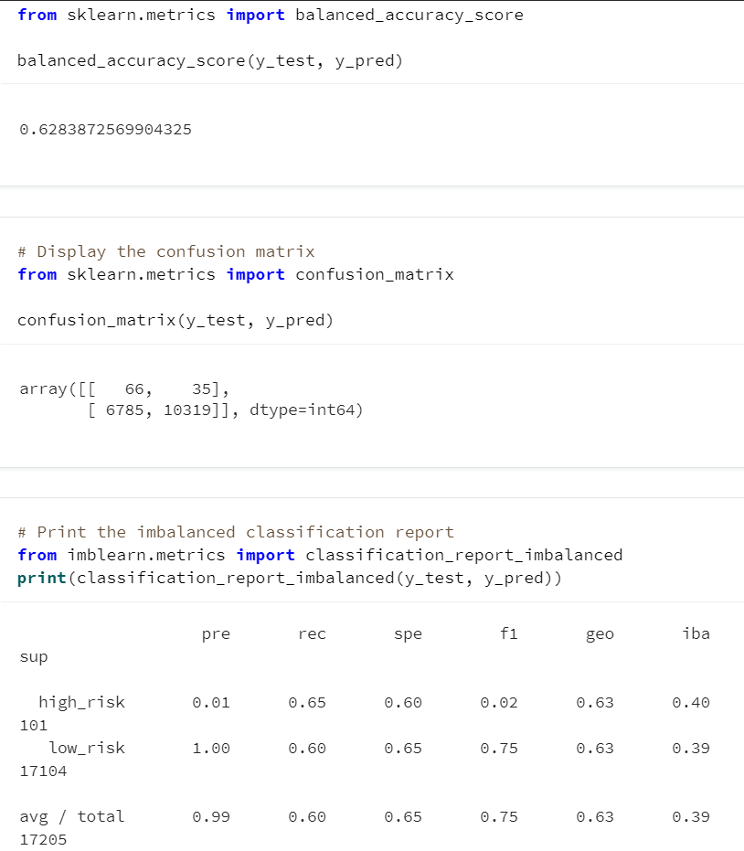
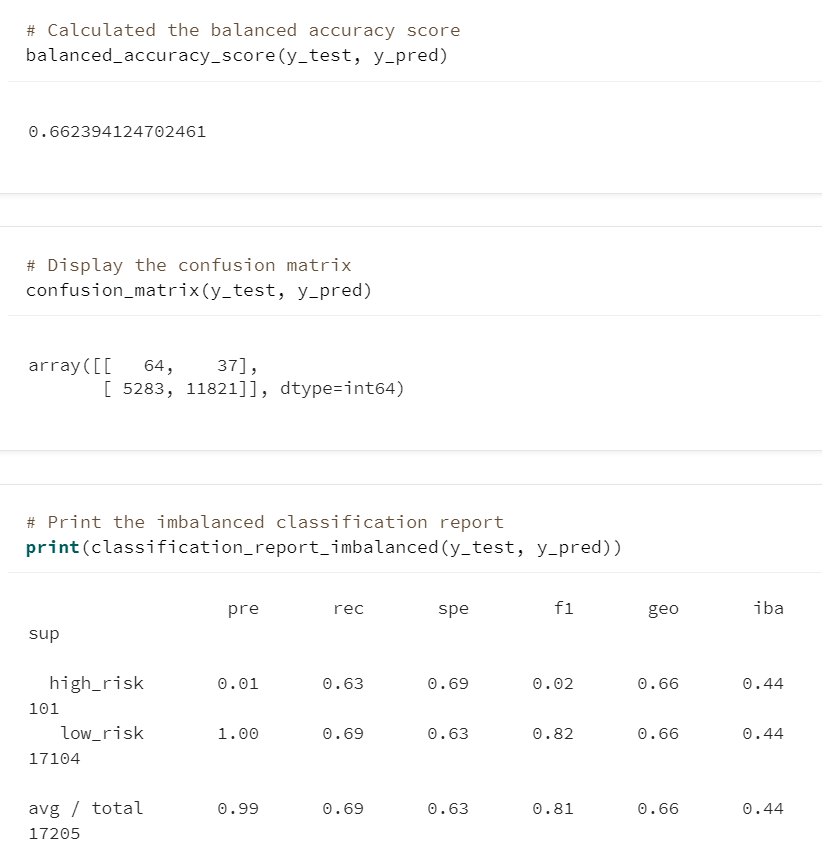
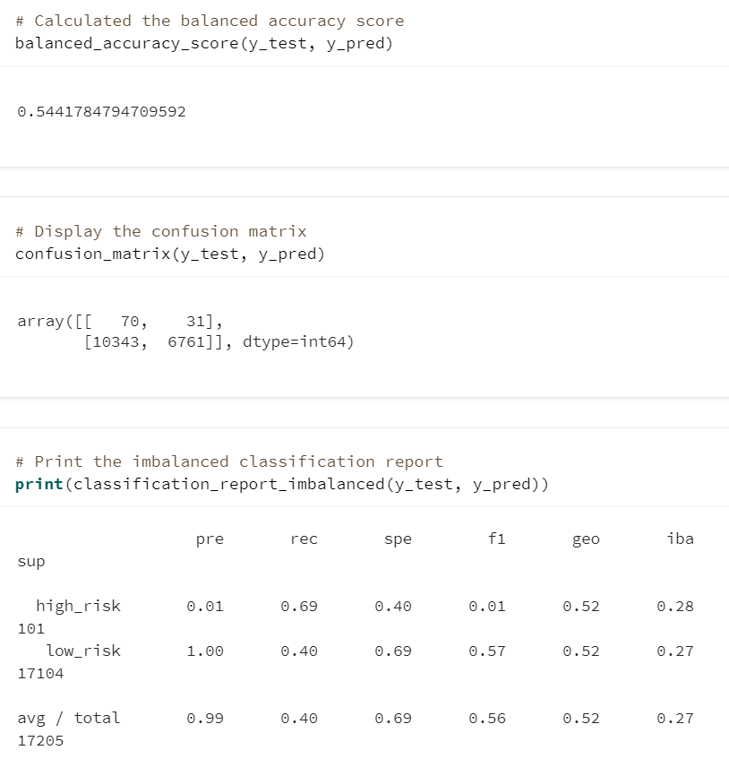
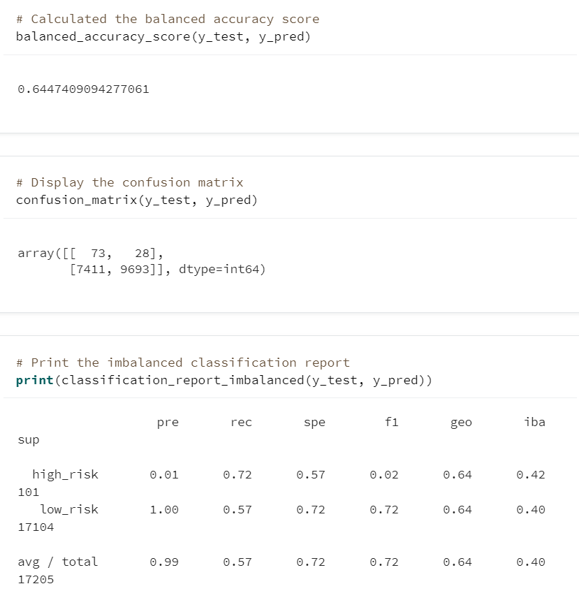
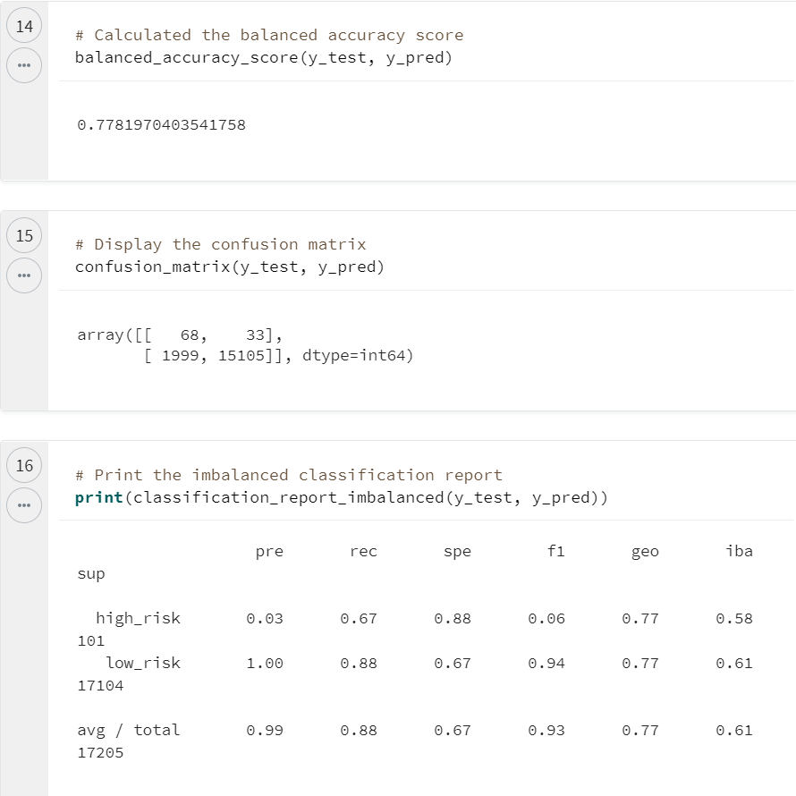
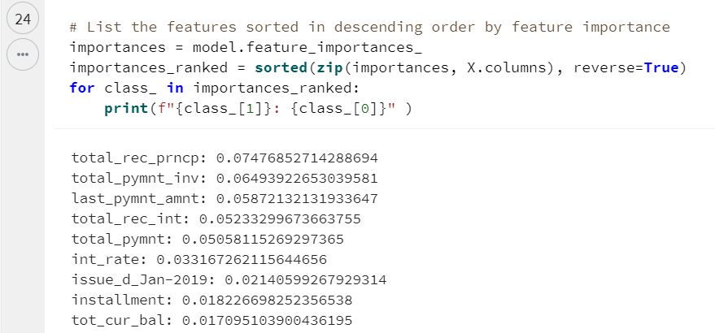
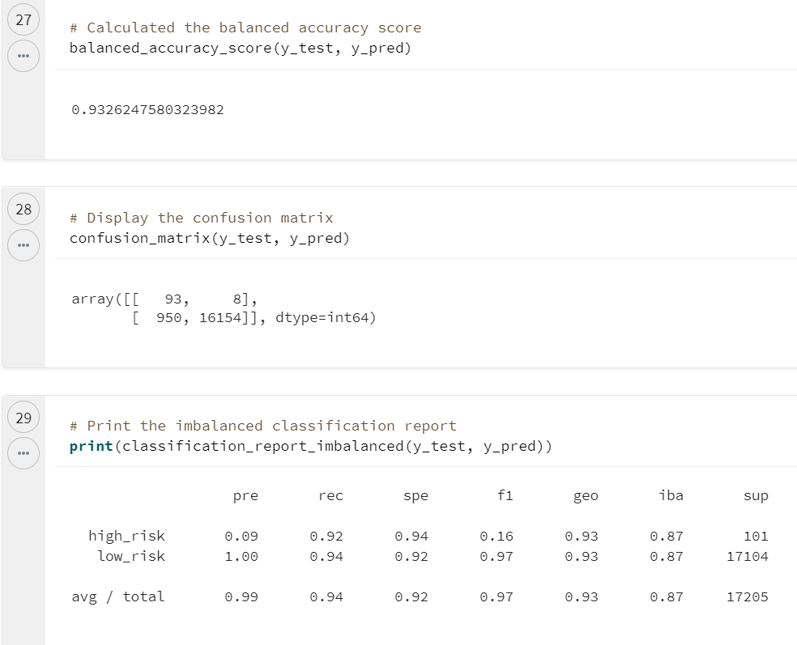

# Credit Risk Analysis

## Overview

We wished to conduct an analysis on which Machine Learning Model Algorith would be the most efficient on predicting credit risk. We used six different models that oversampled and undersampled our data as well as ensemble classifiers to combine several algorithms to get better results. 

For all models we divided our data in training and testing. We also used pandas' ```get_dummies()``` method to split string-based columns into individual, binary, numerical columns. 

## Results

We fit our models with the same data, but resampled as required. After, we made predictions using our testing data to assess the *accuracy*, *precision* and *sensitivity* of our model.

### Oversampled Model with RandomOverSampler

- The accuracy score of this model was measured as **0.63**

- There was a precision of **0.01** for high-risk aplicants and **1.00** for low-risk applications.

- The model had a sensitivity (recall) score of **0.65** for high-risk aplicants and **0.60** for low-risk applications. 



### Oversampled Model with SMOTE

- The accuracy score of this model was measured as **0.66**

- There was a precision of **0.01** for high-risk aplicants and **1.00** for low-risk applications.

- The model had a sensitivity (recall) score of **0.63** for high-risk aplicants and **0.69** for low-risk applications. 



### Undersampled Model with ClusterCentroids

- The accuracy score of this model was measured as **0.54**

- There was a precision score of **0.01** for high-risk aplicants and **1.00** for low-risk applications.

- The model had a sensitivity (recall) score of **0.69** for high-risk aplicants and **0.40** for low-risk applications. 



### Combination Model with SMOTEENN

- The accuracy score of this model was measured as **0.64**.

- There was a precision score of **0.01** for high-risk aplicants and **1.00** for low-risk applications.

- The model had a sensitivity (recall) score of **0.72** for high-risk aplicants and **0.57** for low-risk applications. 



### Ensembled Model with BalancedRandomForestClassifier

- The accuracy score of this model was measured as **0.77**

- There was a precision score of **0.03** for high-risk aplicants and **1.00** for low-risk applications. 

- The model had a sensitivity (recall) score of **0.67** for high-risk aplicants and **0.88** for low-risk applications. 



Furthermore, our model determined our top three features to be: 

1. Total Received Principal

2. Total Payment Invoice

3. Last Payment Amount



### Ensembled Model with EasyEnsembleClassifier

- The accuracy score of this model was measured as **0.93**

- There was a precision score of **0.09** for high-risk aplicants and **1.00** for low-risk applications.

- The model had a sensitivity (recall) score of **0.92** for high-risk aplicants and **0.94** for low-risk applications. 



## Summary

As this analysis has shown, the different models yield varied results, with varying degree of accuracy, precision and sensitivity (recall). Since we are analysing credit risk, we wish to emphasize **precision on high-risk applicants**. As from the business side of things, we want to minimize the risk of default on new loans that the bank may give out. 

In order to accomplish this goal, it is recommended to use the ***EasyEnsembleClassifier model***, which has an overall accuracy score of **0.93**, and as we can see in our confusion matrix, it only flagged **8** high-risk applicants as low-risk, which is the lowest False Negative of all models we tested. 

It is strongly recommended this model be used in this scenario due to its precision and accuracy. 
